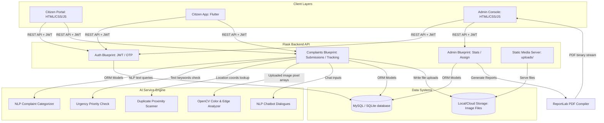

# System Architecture Diagram

This document contains the structural system architecture representing modules, routing layers, and integrations.

```mermaid
graph TD
    %% Citizen Frontend
    subgraph Client Layers
        CitizenWeb[Citizen Portal: HTML/CSS/JS]
        CitizenMobile[Citizen App: Flutter]
        AdminWeb[Admin Console: HTML/CSS/JS]
    end

    %% Web API Servers
    subgraph App Server [Flask Backend API]
        AuthRoute[Auth Blueprint: JWT / OTP]
        CompRoute[Complaints Blueprint: Submissions / Tracking]
        AdminRoute[Admin Blueprint: Stats / Assign]
        StaticService[Static Media Server: uploads/]
    end

    %% AI Modules
    subgraph AI Service Engine
        NLPClassifier[NLP Complaint Categorizer]
        PriorityPredictor[Urgency Priority Check]
        GeoCluster[Duplicate Proximity Scanner]
        CVAnalyzer[OpenCV Color & Edge Analyzer]
        ChatbotCore[NLP Chatbot Dialogues]
    end

    %% Persistent Storage
    subgraph Data Systems
        DBMS[(MySQL / SQLite database)]
        FS[(Local/Cloud Storage: Image Files)]
    end

    %% Navigation Paths
    CitizenWeb -->|REST API + JWT| AuthRoute
    CitizenWeb -->|REST API + JWT| CompRoute
    CitizenMobile -->|REST API + JWT| AuthRoute
    CitizenMobile -->|REST API + JWT| CompRoute
    AdminWeb -->|REST API + JWT| AuthRoute
    AdminWeb -->|REST API + JWT| AdminRoute

    CompRoute -->|NLP text queries| NLPClassifier
    CompRoute -->|Text keywords check| PriorityPredictor
    CompRoute -->|Location coords lookup| GeoCluster
    CompRoute -->|Uploaded image pixel arrays| CVAnalyzer
    CompRoute -->|Chat inputs| ChatbotCore
    
    AuthRoute -->|ORM Models| DBMS
    CompRoute -->|ORM Models| DBMS
    AdminRoute -->|ORM Models| DBMS
    CompRoute -->|Write file uploads| FS
    StaticService -->|Serve files| FS
    
    AdminRoute -->|Generate Reports| PDFLib[ReportLab PDF Compiler]
    PDFLib -->|PDF binary stream| AdminWeb
```
