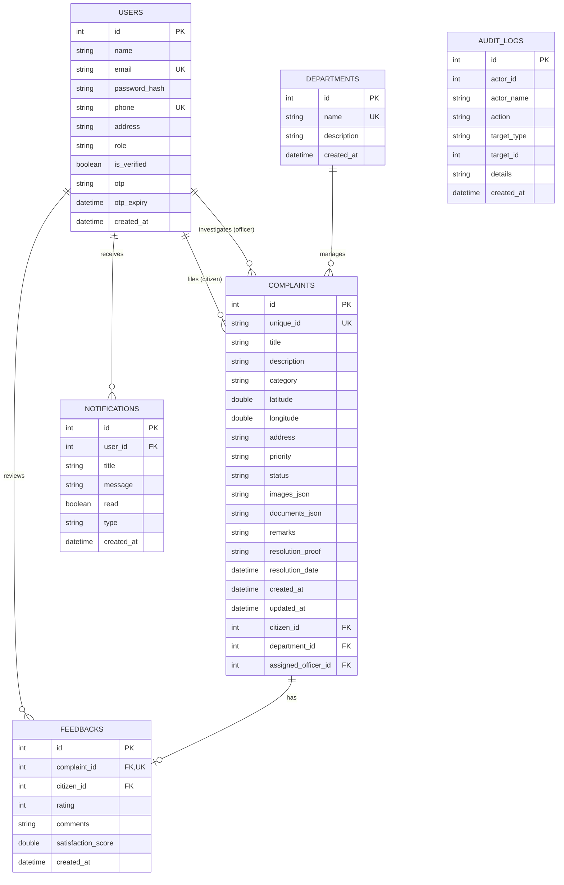

# Entity Relationship (ER) Diagram

The diagram below details database tables, columns, data types, and primary/foreign key connections.

```mermaid
erDiagram
    USERS {
        int id PK
        string name
        string email UK
        string password_hash
        string phone UK
        string address
        string role
        boolean is_verified
        string otp
        datetime otp_expiry
        datetime created_at
    }

    DEPARTMENTS {
        int id PK
        string name UK
        string description
        datetime created_at
    }

    COMPLAINTS {
        int id PK
        string unique_id UK
        string title
        string description
        string category
        double latitude
        double longitude
        string address
        string priority
        string status
        string images_json
        string documents_json
        string remarks
        string resolution_proof
        datetime resolution_date
        datetime created_at
        datetime updated_at
        int citizen_id FK
        int department_id FK
        int assigned_officer_id FK
    }

    FEEDBACKS {
        int id PK
        int complaint_id FK, UK
        int citizen_id FK
        int rating
        string comments
        double satisfaction_score
        datetime created_at
    }

    NOTIFICATIONS {
        int id PK
        int user_id FK
        string title
        string message
        boolean read
        string type
        datetime created_at
    }

    AUDIT_LOGS {
        int id PK
        int actor_id
        string actor_name
        string action
        string target_type
        int target_id
        string details
        datetime created_at
    }

    USERS ||--o{ COMPLAINTS : "files (citizen)"
    USERS ||--o{ COMPLAINTS : "investigates (officer)"
    USERS ||--o{ FEEDBACKS : "reviews"
    USERS ||--o{ NOTIFICATIONS : "receives"
    
    DEPARTMENTS ||--o{ COMPLAINTS : "manages"
    
    COMPLAINTS ||--o| FEEDBACKS : "has"
```
